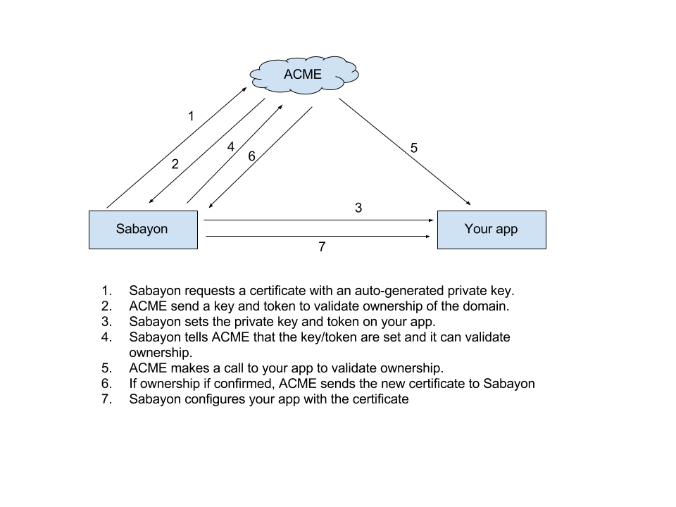

# Sabayon

Automated generation and renewal of ACME/Letsencrypt SSL certificates for Heroku apps.



## Setup

There are two parts to the setup:

1. Activating Heroku's HTTP SNI
1. Your application setup
1. Creating a new sabayon app

## Heroku's HTTP SNI

This project relies on [Heroku's Free SSL](https://blog.heroku.com/archives/2016/5/18/announcing_heroku_free_ssl_beta_and_flexible_dyno_hours) offering.
You need to enable the http-sni lab feature in your project.

> heroku labs:enable http-sni


## Configuring your application

In step 5 (above) ACME calls a specific, unique URL on your application that
allows ownership to be validated. This URL is based upon
[config vars](https://devcenter.heroku.com/articles/config-vars) set by
the sabayon app (both during initial create and on an ongoing basis).

There are a couple options to read the config vars and automagically create
the appropriate URL endpoint.

### Static apps

For a [static app](https://github.com/heroku/heroku-buildpack-static)
change the `web` process type in your Procfile:

    web: bin/start

Add a `bin/start` file to your app:

    #!/usr/bin/env ruby
    data = []
    if ENV['ACME_KEY'] && ENV['ACME_TOKEN']
      data << {key: ENV['ACME_KEY'], token: ENV['ACME_TOKEN']}
    else
      ENV.each do |k, v|
        if d = k.match(/^ACME_KEY_([0-9]+)/)
          index = d[1]

          data << {key: v, token: ENV["ACME_TOKEN_#{index}"]}
        end
      end
    end

    `mkdir -p dist/.well-known/acme-challenge`
    data.each do |e|
      `echo #{e[:key]} > dist/.well-known/acme-challenge/#{e[:token]}`
    end

    `bin/boot`

Make that file executable:

    chmod +x bin/start

Commit this code then deploy your main app with those changes.

### Rails Applications

Add a route to handle the request. Based on [schneems](https://github.com/schneems)'s [codetriage](https://github.com/codetriage)
[commit](https://github.com/codetriage/codetriage/blob/bf86f24afc017f4d90f42deab525c99b7969e99e/config/routes.rb#L5-L9).

There is also a rack example next if you would rather handle this in rack or
if you have a non-rails app.

```ruby

YourAppName::Application.routes.draw do

  if ENV['ACME_KEY'] && ENV['ACME_TOKEN']
    get ".well-known/acme-challenge/#{ ENV["ACME_TOKEN"] }" => proc { [200, {}, [ ENV["ACME_KEY"] ] ] }
  else
    ENV.each do |var, _|
      next unless var.start_with?("ACME_TOKEN_")
      number = var.sub(/ACME_TOKEN_/, '')
      get ".well-known/acme-challenge/#{ ENV["ACME_TOKEN_#{number}"] }" => proc { [200, {}, [ ENV["ACME_KEY_#{number}"] ] ] }
    end
  end
end

```

### Ruby apps

Add the following rack middleware to your app:

```ruby

class SabayonMiddleware
  def initialize(app)
    @app = app
  end

  def call(env)
    data = []
    if ENV['ACME_KEY'] && ENV['ACME_TOKEN']
      data << { key: ENV['ACME_KEY'], token: ENV['ACME_TOKEN'] }
    else
      ENV.each do |k, v|
        if d = k.match(/^ACME_KEY_([0-9]+)/)
          index = d[1]
          data << { key: v, token: ENV["ACME_TOKEN_#{index}"] }
        end
      end
    end

    data.each do |e|
      if env["PATH_INFO"] == "/.well-known/acme-challenge/#{e[:token]}"
        return [200, { "Content-Type" => "text/plain" }, [e[:key]]]
      end
    end

    @app.call(env)
  end
end

```

### Go apps

Add the following handler to your app:

```go
http.HandleFunc("/.well-known/acme-challenge/", func(w http.ResponseWriter, r *http.Request) {
  pt := strings.TrimPrefix(r.URL.Path, "/.well-known/acme-challenge/")
  rk := ""

  k := os.Getenv("ACME_KEY")
  t := os.Getenv("ACME_TOKEN")
  if k != "" && t != "" {
  	if pt == t {
  		rk = k
  	}
  } else {
  	for i := 1; ; i++ {
  		is := strconv.Itoa(i)
  		k = os.Getenv("ACME_KEY_" + is)
  		t = os.Getenv("ACME_TOKEN_" + is)
  		if k != "" && t != "" {
  			if pt == t {
  				rk = k
  				break
  			}
  		} else {
  			break
  		}
  	}
  }

  if rk != "" {
  	fmt.Fprint(w, rk)
  } else {
  	http.NotFound(w, r)
  }
})

```

### Express apps

Define the following route in your app.

```js
app.get('/.well-known/acme-challenge/:acmeToken', function(req, res, next) {
  var acmeToken = req.params.acmeToken;
  var acmeKey;

  if (process.env.ACME_KEY && process.env.ACME_TOKEN) {
    if (acmeToken === process.env.ACME_TOKEN) {
      acmeKey = process.env.ACME_KEY;
    }
  }

  for (var key in process.env) {
    if (key.startsWith('ACME_TOKEN_')) {
      var num = key.split('ACME_TOKEN_')[1];
      if (acmeToken === process.env['ACME_TOKEN_' + num]) {
        acmeKey = process.env['ACME_KEY_' + num];
      }
    }
  }

  if (acmeKey) res.send(acmeKey);
  else res.status(404).send();
});
```

### Other HTTP implementations

In any other language, you need to be able to respond to requests on the path `/.well-known/acme-challenge/$ACME_TOKEN`
with `$ACME_KEY` as the content.

Please add any other language/framework by opening a Pull Request.

## Creating and deploy the sabayon app

In addition to configuring your application, you will also need to create
a new Heroku application which will run sabayon to create and update
the certificates for your main application.

To easily create a new Heroku application with the sabayon code,
click on this deploy button and fill in all the required config vars.

[](https://heroku.com/deploy)

You can then generate your first certificate with the following command (this will add configuration to your main
application and restart it as well).

    heroku run sabayon

Open the [scheduler add-on](https://elements.heroku.com/addons/scheduler) provisioned,
and add the following daily command to regenerate your certificate automatically one month before it expires:

    sabayon

### Force-reload a certificate

You can force-reload your app's certificate:

    heroku run sabayon --force
